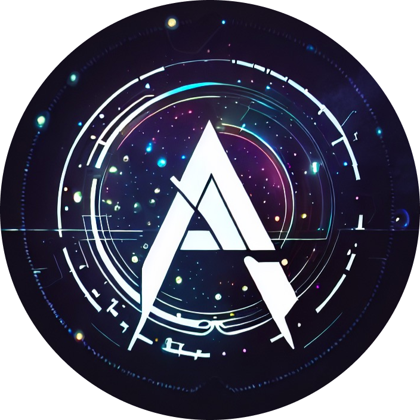

  
<h1 align="center">AI Hub Mix</h1>

涵盖全球最新主流模型，如：OpenAI,Claude,Google,Llama,阿里通义千问等，全部采用OpenAI格式支持 

**负载均衡无需代理 ，无并非限制，企业生产级，大陆直联**

[快速开始](https://aihubmix.com/) / [API说明文档](https://doc.aihubmix.com/) / [详细见模型支持](https://aihubmix.com/models) 

## 站点地址
### https://aihubmix.com

## 计费模式
与官方 API 扣费规则保持一致，充值后额度一直有效，用完为止。

## AI Hubmix
其设计初衷就是要让用户能够更简单、更经济地接入 OpenAI 、Claude、Gemini、Llama等一流的强大 API 功能。通过 AI Hubmix ，用户无需直接申请和管理 OpenAI API 的密钥，他们可以通过我们优化的管道，得到与直接调用 OpenAI 服务完全一致的体验。提供 API ，首页有详细的使用方式，可以用本站部署的 WebUI ，也可以用自己习惯的客户端。

## AI Hubmix 的优势： 
1. 我们是azure 、aws、gcp官方授权代理，所以可以提供稳定大量生产级的credit；
2. 我们接受支付宝作为支付选项，简化支付流程，便于用户的接入和使用。
3. 服务器数据库全部在美国azure云，专业可靠；

## 原理介绍
aihubmix 是一个 OpenAI API 反代服务，它可以让用户直接调用 OpenAI 的人工智能 API ，而无需自行申请 OpenAI API 的额度。在用户调用 API 时，会将请求转发至自己的 open ai api key 账号池中，然后再通过 OpenAI 的官方 API 接口将请求发送至 OpenAI 的服务器进行处理。

aihubmix 的账号池包含多个 OpenAI API 账号，每个账号都具有一定的 API 请求配额。当一个账号的 API 请求配额用完时，orisound 会自动切换到另一个账号，以确保 API 的可靠性和稳定性。同时，aihubmix 还具有高并发处理能力，可以在用户高并发请求时，保持 API 响应速度和稳定性。

## 支持模型
涵盖全球最新主流模型，如：OpenAI,Claude,Google,Llama,阿里通义千问等，全部采用OpenAI格式支持 等；[详细见模型支持]( https://aihubmix.com/models)

P.S.
需要官方 openAI 带 credits 账号的朋友，也可以联系客服
